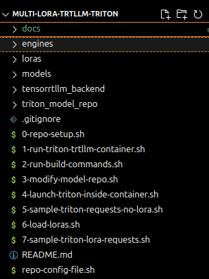
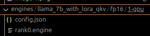
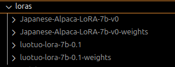
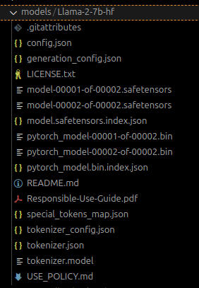
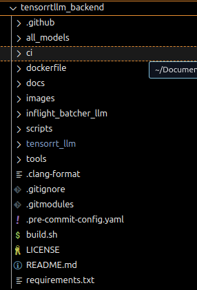
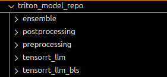

# Deployment Repo Setup

The goal is to setup your deployment repo as follows in order to gothrough all the steps

The engine folder below has the compiled version of the model

The loras weights folders below get populated once you down convert the loras. The other 
folders represent the raw downloaded lora weights 

The folder below shows model pulled from hugging face  

The Tensorrtllm backend folder is downloaded directly with git clone and is used 
to configure the model repository that Triton will host.  

The Triton Model Repo folder is populated once you configure the Tensorrtllm backend  
