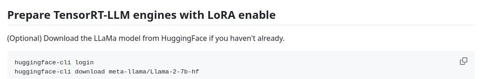
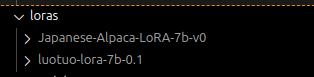

# Download base model and Loras 
If you already have your models and loras ready, then skip this step

Follow the instructions [here](https://github.com/triton-inference-server/tensorrtllm_backend/blob/main/docs/lora.md#prepare-tensorrt-llm-engines-with-lora-enable) to download the llama-2-7b base model from Hugging Face

Note you will need a Hugging Face key to download the model


## Downloading Loras

The instructions for downloading the Loras are available [here](https://huggingface.co/silk-road/luotuo-lora-7b-0.1)
, note that the luotuo lora is outdate so the correct commands are listed here

```
git-lfs clone https://huggingface.co/silk-road/luotuo-lora-7b-0.1  
git-lfs clone https://huggingface.co/kunishou/Japanese-Alpaca-LoRA-7b-v0
```

Once you download you should have two folders each containing the lora weights



## Clone the TensorRTLLM-Backend Repo

Make sure you are in the top level folder of this repo, pull the specific version of the repo below.  
If you are using later versions of Triton, see the [Framework guide](https://docs.nvidia.com/deeplearning/frameworks/support-matrix/index.html) for the TRT-LLM version inside the container
and use that same tag. In this example, Triton is 24.11 and the TRT-LLM version is 0.15.0; therefore, the backend version should be 0.15.0

```
git clone -b v0.15.0 https://github.com/triton-inference-server/tensorrtllm_backend.git
cd tensorrtllm_backend
git submodule update --init --recursive
git lfs install
git lfs pull
```