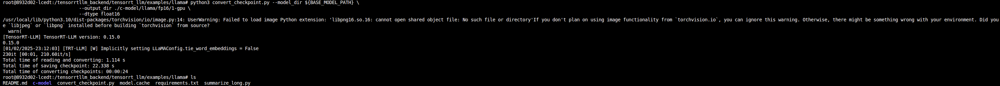
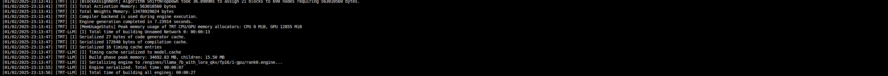
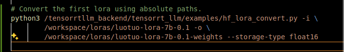
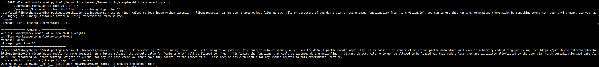

# Build engines and Compatible Loras
The engine is built inside the Triton-TRTLLM container. 

Run the Triton-TRTLLM container with `1-run-triton-trtllm-container.sh` script.

Once inside the container, navigate to your `/workspace`

Use the `2-run-build-commands.sh` script to configure your build commands for TRT-LLM. You may have to edit the `repo-config-file.sh` file as well if some arguments are imported.

Once you run the convert model, you should see an output similar to the one below

You can double-check that a `c-model` folder was created. Edit the script to build to your specifications.

#### Building Engine
Note the output directory points to `/engines` which is mounted inside the container and exists at the top level of the repo.

Once your engine is built successfully, you will see the end of the output, as shown below.

Now that the engine file is built, you can continue to convert the Loras into the correct format. 

#### Convert Lora Weights to Compatible Format
The instructions for converting the Lora weights are [here](https://github.com/triton-inference-server/tensorrtllm_backend/blob/main/docs/lora.md#generate-lora-tensors)

Use the code in `2-run-build-commands.sh` to get the exact commands to convert the loras. Note the paths are absolute with respect to the path structure in the container, based on the launch command.

The output should look like the image below.

Repeat the above two steps for the second lora. Once completed, your folder will look like the image below with added weights folders.

The next step is to prepare the Triton model repository for the TRT-LLM backend.
