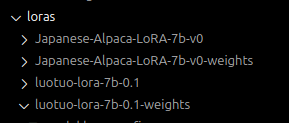

# Build engines and Compatible Loras
The engine is build inside of the Triton-TRTLLM container. 

Run the Triton-TRTLLM container with `1-run-triton-trtllm-container.sh` script

Use the `2-run-build-commands.sh` script to configure your build commands.   
Make sure this script is run inside of the container. 

Once you run the convert model you should see an output similar to the one below

You can double check that a `c-model` folder was created.  
When you run build command inside the script you can edit the values to alter your deployment.

Note the output directory points to `/engines` which is mounted inside of the container and exists at the top level of the repo.

Once your engine is built successfull you will see the end of the output as shown below.

Now the engine file is built you can continue to convert the loras into the correct format. 

The instructions for converting the lora weights are [here](https://github.com/triton-inference-server/tensorrtllm_backend/blob/main/docs/lora.md#generate-lora-tensors)

Use the code in `2-run-build-commands.sh` to get the exact commands to convert the loras. Note the paths are absolute in the container.

The output should look like the image below

Repeat the above two steps for the second lora. Once completed your folder will look like the image below with the weights folders added.

The next step is to prepare the Triton model repository for the TRT-LLM backend.
