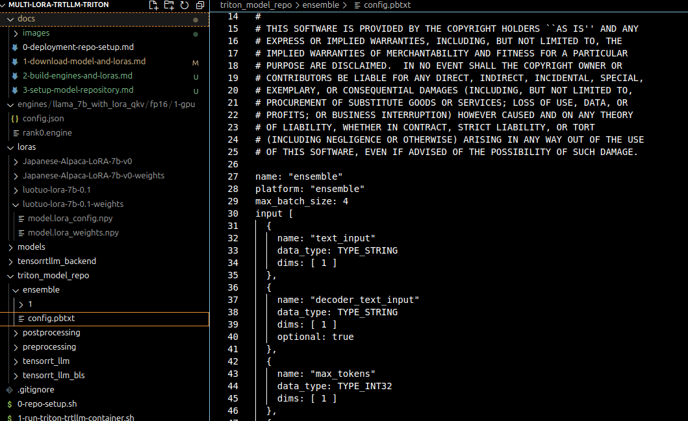

# Setup Model Repository for TRT-LLM Backend in Triton

The TensorRTLLM team has made the model repository setup relatively straightforward to get started. Follow the instructions [here](https://github.com/triton-inference-server/tensorrtllm_backend/blob/main/README.md#prepare-the-model-repository)

This should be done inside of the Triton-TRTLLM container. See file `3-modify-model-repo.sh`, configure it as necessary. All imported configurations are in `repo-config-file.sh`

To confirm that your changes are correct look at the config.pbtxt for the ensemble model and confirm that the max_batch_size is as specified.

Run the `4-launch-triton-inside-container.sh` file to automatically load the model as it is configured to look for the `triton_model_repo` folder you just built. If you want to change the name of the folder, simple configure the name in the `repo-config-file.sh`

A successful startup should look like the image below.

Run the `5-sample-triton-requests-no-lora.sh` to send sample requests. You should see a successful response below.

