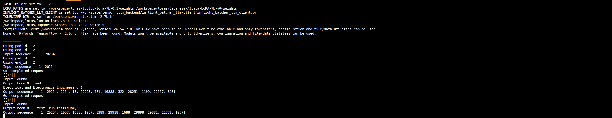
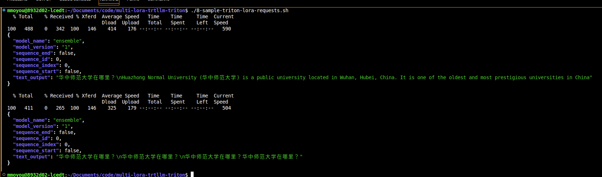

# Load and Query Loras 

Launch a second terminal and run the `6-run-triton-client-container.sh` script.

This will launch a Triton client container so you can load the lora weights into Triton.

Once inside the container, run `7-load-loras.sh`
This will load the loras in a single request. After that you do not need to load the loras like this again.

A successful loading should look like below

Now you can query the loras using `8-sample-triton-lora-requests.sh`

